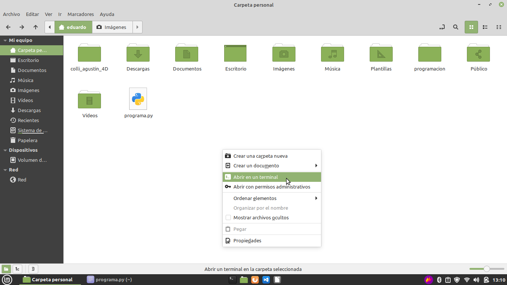

# Apuntes del Club de Programacion

Por: Krapp Ramiro

---

## Nota del autor

Personalmente, **recomiendo encarecidamente con toda mi alma** googlear todo lo posible.
Si no entendés algo del apunte, googlealo, puede ser que en internet
lo encuentres mejor explicado, o encuentres más información.

**No hay nada de malo en googlear, TODO LO CONTRARIO**, internet
es la **MEJOR HERRAMIENTA** que un programador puede tener.

¿Tenés un error en tu código? Googlealo
<br>
¿Necesitás más información sobre un tema en específico? Googlealo

_Ante cualquier problema, google es tu mejor amigo_

---

## Python

---

**Atencion**:
<br> Todo lo que vayas a leer y escribir es **Caps-sensitive**, eso significa
que se hace distinción entre minusculas y mayúsculas.
O sea, si yo escribo `print()`, no va a ser lo mismo que `Print()`, `PRINT()` o `pRiNt()`.

---

### Cómo escribir y correr programas de Python en las computadoras del colegio

Para las computadoras del colegio, el paso a seguir es el siguiente

Primero, abrir el editor de texto


Luego, **guardar el programa**


A este programa que escribimos lo vamos a poner en un archivo, cuyo nombre:

- No contenga espacios
- No contenga caracteres especiales
- Termine en `.py`


Luego, ir a la carpeta donde lo guardamos, clic derecho y abrir en una terminal


Luego, escribir `python3 nombre_del_archivo.py`, reemplazando `nombre_del_archivo.py` por `programa.py` en este caso


Luego, tocar enter, y asi se ejecuta nuestro programa


---

### Comentarios:

Los comentarios en python se escriben poniendo un `#` al principio del comentario

```py
# Esto es un comentario
print("Esto no es un comentario")
```

Los comentarios son **fundamentales** para explicar el funcionamiento del código,
un buen programador comenta su código con frecuencia.

### `print()`

`print` es una **función** _(concepto que todavia no vimos, pero ya vamos a ver)_ que
imprime lo que tenga entre `()` en la terminal. Si entre los `()` ponemos texto entre
comillas `" "` va a imprimir ese texto. Si no ponemos las comillas `" "`,
va a entender que queremos imprimir una variable

Nota: Al texto entre `" "` se lo suele llamar strings. Si leen la palabra String, sepan
que se refiere a un texto

#### Sintaxis

```py
print("texto a imprimir")
```

o

```py
print(variable_a_imprimir)
```

#### Ejemplos de uso:

##### Imprimir Hola gente

```py
print("Hola gente!")
```

###### Resultado:

```
Hola gente!
```

##### Imprimir el valor de una variable

```py
saludo = "Hola gente"
print(saludo)
```

###### Resultado:

```
Hola gente
```

##### Imprimir multiples cosas - Ejemplo usando concatenización

Nota: La concatenizacion tiene un gran problema, y es que solamente te permite
imprimir texto, no te permite imprimir cosas como números.
La solución a esto la vamos a ver en el siguiente ejemplo, que usa fstrings

```py
nombre = "Juan Carlos"
juego_favorito = "Skyrim"
print("Hola, me llamo " + nombre + " y mi juego favorito es " + juego_favorito )
```

###### Resultado:

```
Hola, me llamo Juan Carlos y mi juego favorito es Skyrim
```

##### Imprimir multiples cosas - Ejemplo usando fstrings

Si queremos imprimir multiples cosas en un print, la mejor forma de hacerlo es usando
algo llamado fstrings

Por favor, notar la `f` que está entre `(` y el `"`

```py
nombre = "Juan Carlos"
edad = 13
juego_favorito = "Skyrim"
print(f"Hola, me llamo {nombre}, tengo {edad} años y mi juego favorito es {juego_favorito}")
```

###### Resultado:

```
Hola, me llamo Juan Carlos, tengo 13 años y mi juego favorito es Skyrim
```

### Variables

Las variables son una de nuestras mejores herramientas. Estas nos permiten almacenar datos
en la memoria, a los cuales despues vamos a poder acceder y modificar.

#### Sintaxis:

```py
nombre_de_la_variable = valor_de_la_variable
```

#### Tipos de variables / Tipos de datos

En Python no todas las variables son iguales, sino que hay tipos. Una variable de un tipo
solamente puede almacenar valores de su mismo tipo. Este concepto tambien es conocido como el **tipo de dato**, o **datatype.**

Para tirar un **ejemplo** tonto, imaginemos que estamos jugando un videojuego en el que hay
dos tipos de personajes, _los elementales de agua, y los elementales de fuego._
<br>
Los elementales de **agua** solamente pueden usar hechizos de **agua**, y
los elementales de **fuego** solamente pueden usar hechizos de **fuego**.

Bueno, en python pasa algo parecido con los tipos de dato.

**Principalmente, hay tres tipos de dato:**

- Variables de texto (Strings)
- Variables numericas (integers, floats)
- Variables lógicas (bools)

##### Variables de texto (`String`)

Las **variables de texto**, generalmente llamadas **String**, son variables que pueden
almacenar texto en ellas.

###### Ejemplo:

```py
mi_nombre = "Ramiro"
```

##### Variables numericas (`int y float`)

Las **variables numéricas** son variables que almacenan números (¿qué sorpresa no?).
<br>
En la programación se diferencian entre numeros enteros (1, 2, 3, -1, -2, -3, 0)
y numeros con coma (1.342, -1.5, -0.999, 0.666).
<br>

- A los números enteros se les dice integer, pero se les conoce normalmente como **int**
- A los numeros con coma se les dice **float**

**Nota:** Cuando programamos usamos el `.` para indicar donde empieza la coma en un float,
porque en programacion la coma `,` se usa para armar **listas**,
que es un concepto que viene más adelante.

###### Ejemplo

```py
porciones_pizza = 8 # Esta variable es de tipo int
pi = 3.14 # Esta variable es de tipo float
```

##### Variables lógicas (`bool`)

Las **variables lógicas** son variables que pueden almacenar solamente **DOS** valores,
**Verdadero** (`True`) o **Falso** (`False`).

A estas variables tambien se les suele llamar **variables booleanas**, esto es porque el creador se apellidaba Bool, mira que había apellidos raros :/

La forma más facil de entender a las variables lógicas es imaginarse que en nuestro código
queremos guardar el estado de una lamparita

###### Ejemplo

```py
lamparita_prendida = True  # La lamparita esta prendida
lamparita_prendida = False # La lamparita esta apagada
```

A simple vista, no parecen tener mucho uso, pero cuando usemos `if`
nos van a ser **fundamentales**. Por qué? porque con `if` podríamos checkear
si la lamparita esta prendida, y actuar en base al estado de la lamparita.

**Dato curioso:** A veces, se suele representar `True` como `1`, y `False` como `0`.
Personalmente, no lo veo muy recomendable, porque suele traer problemas,
lo mejor es usar `True` y `False`.

---

#### Averiguar el tipo de una variable

Si no sabes el tipo de una variable y querés averiguarlo, tenes la función `type()`

Cómo se usa? Así:

```py
mi_texto = "Aguante Boca"
print(f"El tipo de la variable es: {type(mi_texto)}") # Imprime <class 'str'>

mi_numero = 420
print(f"El tipo de la variable es: {type(mi_numero)}") # Imprime <class 'int'>
```

#### Cómo cambiarle el tipo a una variable

##### Pasar de `int` a `string`

```py
mi_numero = 15
mi_texto = str(mi_numero)
```

##### Pasar de `string` a `int`

```py
mi_texto = "15"
mi_numero = int(mi_texto) #
```

#### Sobreescribir el valor de una variable

Hay un truquito muy útil en la programación, y es que si se le quiere sumar 1 a una
variable, la forma más facil de hacerlo es esta:

```py
mi_cuenta = 0
print(mi_cuenta) #Imprime 0
mi_cuenta = mi_cuenta +1
print(mi_cuenta) #Imprime 1
```

Lo que hay que tener en cuenta es que **el valor de una variable puede variar** a medida
que avanza el programa

**Pro-tip:** Esto se puede hacer más corto, en vez de escribir `mi_cuenta = mi_cuenta +1`,
se puede escribir lo siguiente, con el mismo resultado:

```py
mi cuenta += 1
```

---

#### Ejemplos de uso de variables

##### Guardar un texto en una variable

Como es texto, uso `" "`

```py
mi_nombre = "Ramiro"
```

##### Guardar un numero en una variable

Como **NO** es texto, sino que es un numero, **NO** uso `" "`

```py
mi_edad = 18
```

##### Guardar la suma de dos numeros en una variable

```py
suma = 3+15
```

`suma` ahora vale `18`

##### Guardar la suma de dos variables en una tercera variable

```py
num_1 = 3
num_2 = 5

num_3 = num_1 + num_2
```

`num_3` ahora vale `8`

### `input()`

`input()` es una funcion que nos permite recibir datos del usuario en forma de string.

Esta funcion espera que escribas algo en la terminal y que toques enter. Cuando tocaste
enter, guarda lo que escribiste en una variable que le hayas indicado

#### Sintaxis

```py
mi_variable = input("Mensaje a mostrar al usuario")
```

#### Ejemplos:

##### Ejemplo 1 - Ingreso de nombre de usuario

Un ejemplo muy sencillo puede ser un programa que pida al usuario que ingrese su nombre,
y que luego imprima en pantalla el nombre del usuario.

```py
nombre_usuario = input("Ingresa tu nombre: ")
print(f"El nombre del usuario es: {nombre_usuario}")
```

Cuando nosotros ejecutemos este código, nos va a aparecer en la terminal:

```
Ingresa tu nombre:
```

con un cursor parpadeando. Esto significa que el programa esta esperando que nosotros
escribamos texto y apretemos enter para enviar ese texto que escribrimos.

Imaginemos que escribimos _Juancito_.
<br>
Inmediatamente despues de que tocamos enter,
"Juancito" se va a guardar en `nombre_usuario`, por lo que podemos decir que
`nombre_usuario = "Juancito`

Al final, se termina ejecutando el `print()`, el cual va a mostrar en pantalla:

```
El nombre del usuario es: Juancito
```

---

##### Ejemplo 2 - Ingreso de edad del usuario

Cuando queremos dejar de introducir texto, para empezar a introducir numeros, la cosa
cambia un poco.
Como se había dicho antes, `input()` guarda lo ingresado como texto (String)

Si queremos cambiar este funcionamiento, lo único que hay que hacer
es **especificar que queremos que se guarde como un int**.
¿Cómo? Asi:

```py
edad_usuario = int(input("Ingresa tu edad: "))
print(f"La edad del usuario es {edad_usuario}")
```

Ayudandonos de la funcion `int()`, le podemos decir al input que guarde
lo que ingresamos como si fuera una variable de tipo numerico.

**Nota:** `int()` lo guarda como si fuera un numero entero.
Si queremos que sea un número con coma, tenemos que usar `float()`, resultando en
`float(input())`

---

### `if` (condicionales)

**Ahora si empieza lo bueno**

A veces un programa va a tener que tomar decisiones.
Estas decisiones pueden ejecutar diferentes piezas de código, dependiendo de
ciertas condiciones.

El `if` es una herramienta que nos permite como programadores hacer preguntas,
y actuar en consecuencia a las respuestas que obtenemos.

En python el `if` es usado para hacer preguntar condicionales, y controlar lo que se
llama como **control del flujo**


#### Sintaxis

```py
if condicion:
	# Lo que esta aca adentro se ejecuta si es verdadero
else:
	# Lo que esta aca adentro se ejecuta si es falso
```

---

🛑 🛑 🛑 🛑 🛑 🛑 🛑 🛑 🛑 🛑 🛑 🛑

---

##### MUY IMPORTANTE!!! -- Nota sobre la identacion

Notar que los comentarios # del codigo de arriba que hay estan **identados**, eso quiere decir que hay una tabulacion (o sea, espacios)
entre la linea del if y la linea del comentario.
Esto es **OBLIGATORIO**, porque asi python entiende que es lo que está adentro del if

Por ejemplo, en este codigo


los primeros dos `print`, los de "no podes pasar" y "sali de aca" pertenecen al primer `if`,
y el print del `else` solamente pertenece al else. Esto es porque **esta identado**!!!.
Ademas, el `print("finaliza el programa")` NO pertenece al else, porque **no esta identado**

---

🛑 🛑 🛑 🛑 🛑 🛑 🛑 🛑 🛑 🛑 🛑 🛑

---

#### Operadores

En python, el `if` permite checkear cosas de distintas formas, usando **operadores**

- `==` Checkea igualdad
- `!=` Checkea desigualdad
- `<` Checkea si es menor
- `<=` Checkea si es menor o igual
- `>` Checkea si es mayor
- `>=` Checkea si es mayor o igual

#### Ejemplos

##### Ejemplo de checkear un bool

```py
boton_presionado = True
lamparita_prendida = False

if boton_presionado == True:
	# Este codigo de aca SOLAMENTE se ejecuta si boton_presionado es True !!!
	lamparita_prendida = True
else:
	# Este codigo de aca SOLAMENTE se ejecuta si boton_presionado es False !!!
	lamparita_prendida = False

print(f"El estado de la lamparita es: {lamparita_prendida}")
```

En este ejemplo, al final del codigo, `lamparita_prendida` va a ser `True`.
Si nosotros alteramos nuestro código para que `boton_presionado` sea `False`,
al final del codigo `lamparita_prendida` va a ser `False`

##### Ejemplo de checkear si un numero es mayor a 10

```py
numero = int(input("Ingrese un número: "))

if numero > 10:
	print("El numero es mayor a 10")
else:
	print("El numero es menor a 10")
```

##### Ejemplo de checkear si un número es igual a 10

```py
numero = int(input("Ingrese un número: "))

if numero == 10:
	print("El numero es 10")
else:
	print("El numero es distinto de 10")
```

##### Ejemplo de checkear si un número es distinto de 10

```py
numero = int(input("Ingrese un número: "))

if numero != 10:
	print("El numero es distinto de 10")
else:
	print("El numero es 10")
```

##### Ejemplo de checkear si un alumno esta aprobado

```py
nota_alumno = int(input("Ingrese la nota del alumno"))

if nota_alumno >= 7:
	print("El alumno está aprobado :D ")
else:
	print("El alumno esta desaprobado :( ")
```

### Uso de `elif` (`else if`)

Si se quieren checkear para multiples casos, se puede usar algo
llamado `elif` (que significa `else if`)

El `elif` es la forma de decir "si la condicion anterior no fue verdadera,
intenta con esta condicion"

##### Ejemplo mejorado de checkear si un alumno esta aprobado

```py
nota_alumno = int(input("Ingrese la nota del alumno": ))

if nota_alumno == 10:
	# Se entra aca solamente si la nota es 10
	print("El alumno tiene nota perfecta!")
	aprobacion = True

# Lo que esta a partir de este punto solamente se ejecuta si el if anterior no se cumplió
elif nota_alumno >= 7:
	# Se entra aca si la nota es mayor o igual a 7
	print("El alumno está aprobado :D ")
	aprobacion = True

#De vuelta,
#Lo que esta a partir de este punto solamente se ejecuta si el if anterior no se cumplió
elif nota_alumno >= 5:
	# Se entra aca si la nota es mayor o igual a 5
	print("El alumno esta desaprobado, pero puede recuperarse :( ")
	aprobacion = False

#De vuelta,
#Lo que esta a partir de este punto solamente se ejecuta si el if anterior no se cumplió
elif nota_alumno >= 1:
	# Se entra aca si la nota es mayor o igual a 1
	print("El alumno esta terriblemente desaprobado, F")
	aprobacion = False

#De vuelta,
#Lo que esta a partir de este punto solamente se ejecuta si el if anterior no se cumplió
elif nota_alumno == 0:
	# Se entra aca si la nota es igual a 0
	print("RIP, nos vimos en diciembre")
	aprobacion = False

print(f"Aprobacion: {aprobacion}")
```

#### `if` encadenados

Los if se pueden uno atras del otro, formando una cadena (a esto tambien se le
llaman if en cascada)

```py
x = int(input("Ingresa un numero entero: "))

if x > 10:
	print("El número es mayor a 10")
	if x > 20:
		print("Y tambien mayor que 20!")
	else:
		print("Pero no es mayor que 20.")
```

Los if encadenados tienen un problema, y es que **en algunos casos**, si son muchos
if encadenados suelen generar lo que se conoce como "código hadouken", que es algo así:


---

### Uso de `or` y `and` - Checkeo de multiples cosas en un if

Cuando uno usa un `if`, puede checkear por multiples cosas, usando `or` y `and`

- `or` checkea si alguna de las condiciones son verdaderas
- `and` checkea si todas de las condiciones son verdaderas

#### Ejemplo con `or`

```py
numero = int(input("Ingresa un número: "))

if numero == 1 or numero == 2:
	print("El numero que introduciste es 1 o es 2, alguno de los dos es")
```

#### Ejemplo con `and`

Este ejemplo usa el operador `%`. Lo que hace el operador `%` es checkear cual es el
resto de un numero cuando lo dividis por otro.
<br>
En el codigo, para ver si el numero es par lo que se hace es dividir numero por
dos, y ver si el resto es 0.
<br>
Luego, se checkea si es impar, viendo que el resto de cuando lo dividis por 2 no sea 0

```py
if numero < 10 and numero % 2 == 0:
	print("El numero es mayor a 10 y es par")
elif numero % 2 != 0:
	print("El numero es impar")
```

---

### Listas

Una lista es un tipo de variable usada para almacenar multiples items en una sola variable.
Estos multiples items pueden ser de cualquier tipo, tanto strings, como ints, como floats,
como bools

Uno declara una lista de forma similar a la que se declara una variable, y le asigna los
elementos que tiene adentro escribiendolos adentro de unos corchetes `[]` separados por comas,
de la sigiente forma:

```py
cosas_verduleria = ["manzana", "banana", "naranja"]
```

Cuando Python guarda los elementos adentro de una lista, les asigna un indice, que comienza
en 0, como lo muestra la siguiente imagen, en la que hay una lista que tiene distintos
colores en ingles:


Para acceder a un elemento de la lista yo tengo que hacer lo siguiente:

```py
cosas_verduleria = [indice]
```

Por ejemplo, si yo quisiera acceder al primer elemento, o sea, `"manzana"`,
para poder imprimirlo, debería hacer lo siguiente:

```py
print(cosas_verduleria[0]) # esto imprime "manzana"
```

Por qué 0? Bueno, mira la imagen. Si te fijas, el elemento con el indice = 0 es el primero.
Para el segundo elemento, habría que hacer

```py
print(cosas_verduleria[1]) # Esto imprime banana
```

Ahora, que pasas si hacemos asi?

```py
print(cosas_verduleria[3]) # Esto me tira un ERROR!
```

Chan chan chaaaan, nos tira un error 0_0. ¿Por qué? Y porque `[3]` indica el 4to elemento
de la lista, y nosotros solamente tenemos 3 en nuestra lista.
Para los más curiosos, el error se ve así:

```py
Traceback (most recent call last):
  File "/home/krapp/test.py", line 2, in <module>
    print(cosas_verduleria[4])
IndexError: list index out of range

```

#### Para que las usamos?

Imaginate que tenés que hacer un programa, que reciba el nombre de 10 usuarios.
Con lo que aprendiste hasta ahora, la única opción que tenes es tener 10 variables:

```py
nombre_persona_1 = "Juan"
nombre_persona_2 = "Pepe"
nombre_persona_3 = "Agustina"
nombre_persona_4 = "Carla"
nombre_persona_5 = "Zefirot"
nombre_persona_6 = "Gaburro"
nombre_persona_7 = "Maria"
nombre_persona_8 = "Juan Carlos"
nombre_persona_9 = "Guillermo"
nombre_persona_10 = "Pablo"
```

La realidad es que esa solución es muy incómoda y tiene muchos problemas. Por suerte,
en python existe algo llamado listas, que nos permite sintetinzar ese choclo de 10 variables en la siguiente linea:

```py
nombres = ["Juan", "Pepe", "Agustina", "Carla", "Zefirot", "Gaburro", "Maria", "Juan Carlos", "Guillermo", "Pablo"]
```

Esto simplifica **mucho** laburar con multiples variables, usenlo que sirve un monton.

#### Acceder a los ultimos elementos de una lista

Antes vimos que con `cosas_verduleria[0]` accedimos al **primer** elemento de la lista,
que con `cosas_verduleria[1]` accedemos al **segundo** elemento, y que con
`cosas_verduleria[2]` accedemos al **tercer** elemento, y asi...

Pero que pasa si queremos acceder al **ultimo elemento**? Bueno, hay que pasar a usar
**indices negativos**. Suena raro, pero es re sencillo.

**Para acceder al ultimo elemento**, hay que hacer `cosas_verduleria[-1]`. Por que?
Porque `[-1]` simboliza el ultimo elemento.
Y para acceder al anteultimo? `cosas_verduleria[-2]`

#### Agregar elementos a una lista

Para agregar elementos a una lista, usamos el **método** `append()` (Los metodos son los que usas el `.` antes de usarlos)

Para el ejemplo, vamos a usar a nuestra amada y queridisima, `lista_verduleria`.
Recordemos que la lista era asi:

```py
cosas_verduleria = ["manzana", "banana", "naranja"]
```

Si queremos agregar a la lista unas uvas, debemos hacer asi:

```py
cosas_verduleria.append("uvas")
```

Despues de hacer eso, los elementos de la lista quedan asi: `["manzana", "banana", "naranja", "uvas"]`

#### Eliminar elementos a una lista

Para eliminar elementos de una lista, hay dos métodos principales, el método `pop()` y el método `remove()`

##### `remove()`

`remove()` remueve el elemento especificado.

En este codigo, remuevo a la banana de la lista

```py
cosas_verduleria = ["manzana", "banana", "naranja"]
cosas_verduleria.remove("banana")
print(cosas_verduleria) # Esto imprime ["manzana", "naranja"]
```

##### `pop()`

`pop()` remueve el elemento que esta en el indice especificado

```py
cosas_verduleria = ["manzana", "banana", "naranja"]
cosas_verduleria.pop(1)
print(cosas_verduleria) # Esto imprime ["manzana", "naranja"], porque el elemento 1 es "banana"
```

Si no especificas el indice, `pop()` remueve el último elemento

```py
cosas_verduleria = ["manzana", "banana", "naranja"]
cosas_verduleria.pop()
print(cosas_verduleria) # Esto imprime ["manzana", "banana"]
```

##### `clear()`

Vieron que les dije que habia dos métodos principales? Bueno les mentí xdxd.
El método `clear()` vacía la lista. La lista todavía existe, pero no tiene elementos adentro

```py
cosas_verduleria = ["manzana", "banana", "naranja"]
cosas_verduleria.clear()
print(cosas_verduleria) # Esto imprime [], porque esta vacia lol
```

#### Slicing de Listas

A veces, queremos acceder no a un elemento en especifico de la lista, sino a un rango de elementos.
Y vos te preguntaras, que carajo significa eso?
Bueno, es sencillo, acceder a un rango es acceder a cosas como
**los primeros 3 elementos de la lista**, o a
**los ultimos 3 elementos dela lista**, o a
**todos los elementos desde el 2do al 5to** (o sea, 2do, 3ro, 4to y 5to).

Esto se hace normalmente con **Slicing**, con el slicing, uno pone como indice un rango
de elementos, con la siguiente sintaxis:

```py
mi_lista[inicio:fin]
```

##### Ejemplos de uso

```py
# Vamos a trabajar con esta lista de nombres
nombres = ["Juan", "Pepe", "Agustina", "Carla", "Zefirot", "Gaburro", "Maria", "Juan Carlos", "Guillermo", "Pablo"]

# Acceder a los primeros 3 elementos
nombres[0:3]# Esto imprime ['Juan', 'Pepe', 'Agustina']

# Otra forma de acceder a los primeros 3 elementos
nombres[:3] # Esto imprime ['Juan', 'Pepe', 'Agustina']

# Acceder a los ultimos 3 elementos
nombres[-3:] # Esto imprime ['Juan Carlos', 'Guillermo', 'Pablo']

# Acceder a los elementos desde el 2do al 5to
print(nombres[1:6])  # Esto imprime ['Pepe', 'Agustina', 'Carla', 'Zefirot', 'Gaburro']
# Te vas a preguntar, por que es [1:6? Bueno, porque empezamos a contar desde el 0, y el
# numero del ultimo indice no es inclusivo
```

### Pequeña introducción a los bucles

Por fin llegamos a una de las cosas más usadas en python, los bucles. Pero primero, que es un bucle?
Un bucle es una acción que se repite una vez, y otra vez, y otra vez, y otra vez,
y otra vez, y otra vez, y otra vez, y otra vez, y otra vez...
hasta que en momento, **PUM**, para de ejecutarse.

(Si nunca parara de ejecutarse, es lo que se conoce como un **bucle infinito**.
Ya se, con cada termino nuevo, la programación parece cada vez más una peli de Marvel
y menos una rama de las ciencias informáticas)

Bueno, en python los bucles son **muy**, pero **MUY** útiles. Por qué? porque nos permiten
repetir una (o más) acciones una cantidad determinada (bucle for) o indeterminada de veces (bucle while)

### Bucles usando `for`


Los bucles `for` permiten hacer una acción una determinada cantidad de veces. Uno de los ejemplos
más sencillos que hay para entender a los bucles `for` es este ejemplo, que imprime todos los elementos
que hay adentro de la lista frutas.

```py
frutas = ["manzana", "banana", "naranja"]
for x in fruits:
	print(x)
```

Este codigo imprime

```
manzana
banana
naranja
```

Lo que pasa en este codigo es que por cada valor que hay en frutas, x adquiere su valor,
y pasa lo que hay adentro del for.

### Bucles usando `while`


## El sistema de archivos de Linux

La carpeta home `~` es la carpeta del usuario, donde el usuario tiene todos sus
archivos personales

## Uso de Bash (La terminal)

La consola, la linea de comandos, la terminal, son todos nombres que se usan para referirse
a la <u>shell</u> por defecto de Linux, **Bash**.

Qué es la terminal? La terminal es lo que usamos los programadores para poder **comunicarnos
directamente con la computadora**, usando comandos específicos, que cumplen una
tarea en concreto.

### Comandos de bash

Hay muchos comandos? Si, hay un montonazo, pero uno **solamente usa los que necesita**,
y son más bien pocos, los más importantes son:

#### `ls`

Muestra en la terminal los contenidos del directorio actual.

Qué es un directorio? Un directorio es lo que se conoce normalmente como una carpeta.
O sea, `ls` muestras los contenidos de la carpeta actual en la que estas localizado.

Cómo se usa? Simplemente hay que escribir `ls`, y tocar enter para ejecutar el comando

Un resultado tipico de `ls` cuando uno esta en `~` (home) puede ser:

````

Descargas
Documentos
Imagenes
Musica
foto_gato.jpg
lista_compras.txt
ejercicios_matematicas.pdf

```

**Pro-tip:**
Si se desean ver los archivos ocultos, los cuales empiezan con un punto `.` , se debe
usar `ls -a`

---

#### `cd`

Cambia el directorio actual al que uno especifique.

Para dar un ejemplo, imaginemos que estoy en la carpeta `~` (home) ,
y ls me dió el siguiente resultado:

```

Descargas
Documentos
Imagenes
Musica
foto_gato.jpg
lista_compras.txt
ejercicios_matematicas.pdf

````

Si yo quisiera cambiar a la carpeta (o directorio) Documentos, lo unico que tendria que hacer es

```bash
cd Documentos
```

y ya estaría adentro de la carpeta (o directorio) Documentos.

Tambien, si adentro de la carpeta (o directorio) Documentos hubiera otra carpeta,
por ejemplo "Recibos_de_pago/", yo podría hacer

```bash
cd Documentos/Recibos_de_pago/
```

Y me mandaría directamente adentro de Recibos_de_pago

Otra cosa, si se usa simplemente `cd` **sin indicarle ninguna carpeta** (lo que tecnicamente
se llama "no pasarle argumentos"), `cd` te manda a la carpeta `~` (home)

---

#### `sudo`

Permite ejecutar un comando como un usuario administrador,
conocido en linux como usuario **root**.
Sirve cuando un comando tiene que modificar archivos del sistema y/o instalar aplicaciones.

Para usuarlo, lo único que hay que hacer es escribir

```bash
sudo comando_a_ejecutar_aqui
```
