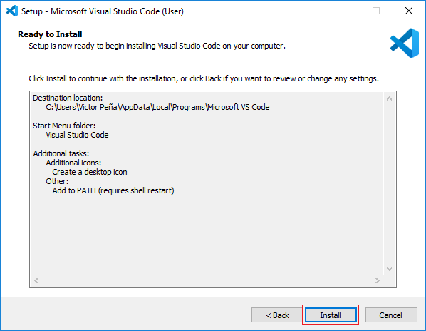
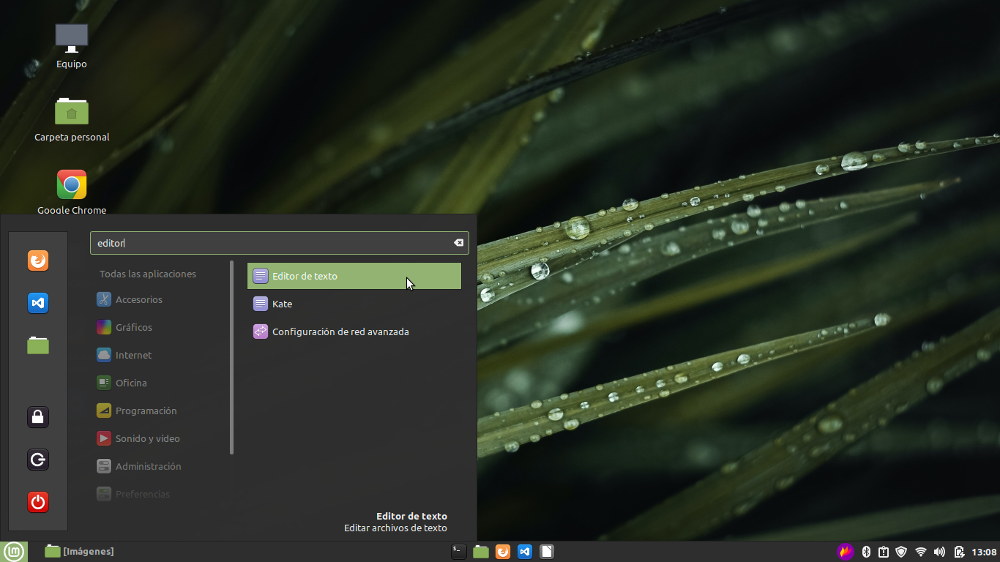
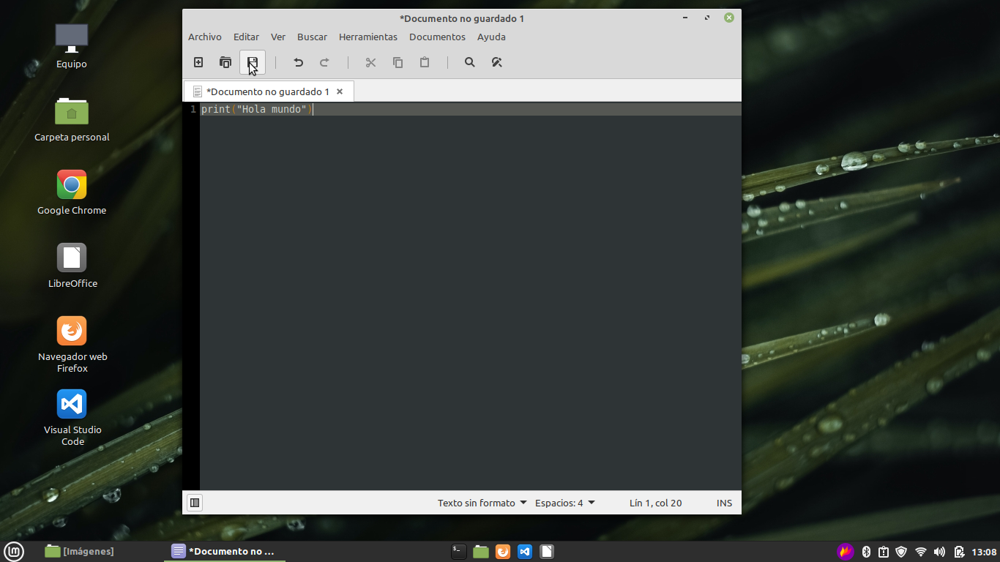
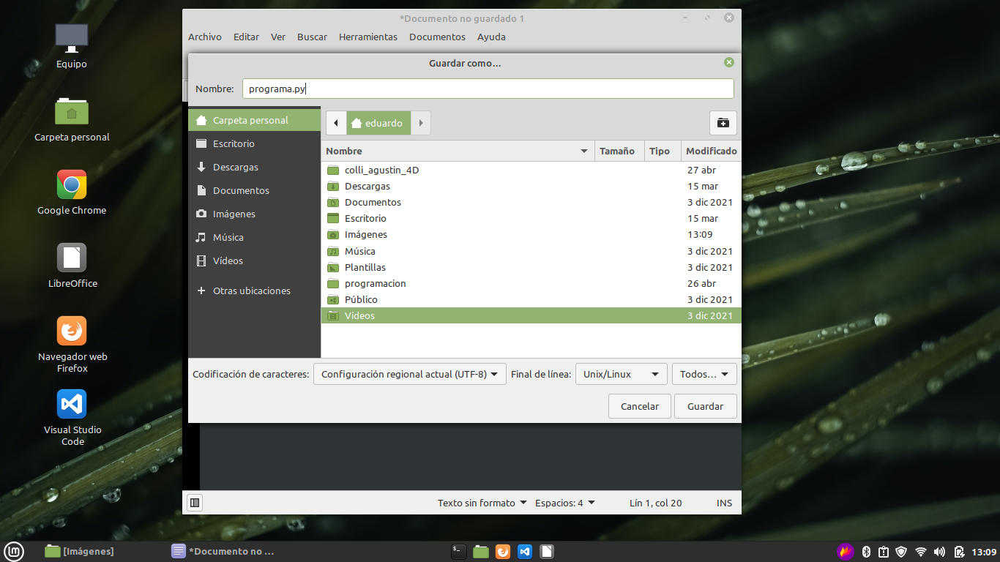
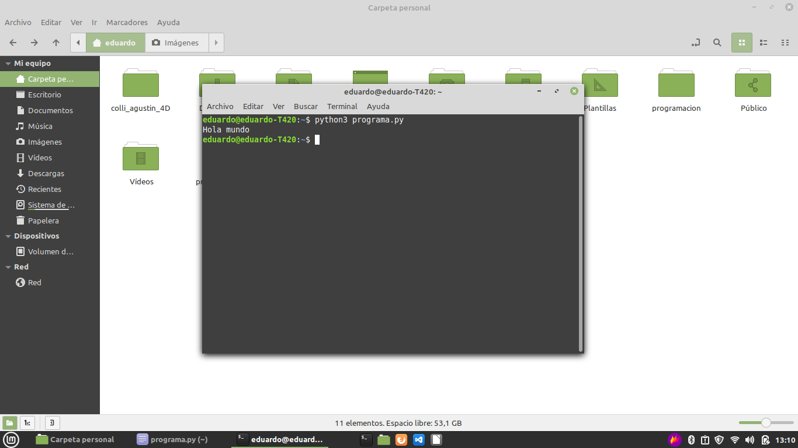
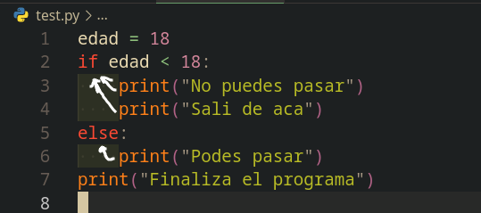

# 1. Apuntes del Club de Programacion

Por: Krapp Ramiro

---

- [1. Apuntes del Club de Programacion](#1-apuntes-del-club-de-programacion)
	- [1.1. Nota del autor](#11-nota-del-autor)
	- [1.2. Nota sobre mayusculas y minusculas](#12-nota-sobre-mayusculas-y-minusculas)
	- [1.3. Recomendacion personal:](#13-recomendacion-personal)
	- [1.4. Cómo escribir y correr programas de Python en sus computadoras personales \[Windows\]](#14-cómo-escribir-y-correr-programas-de-python-en-sus-computadoras-personales-windows)
		- [1.4.1. Instalacion de Visual Studio Code (vscode para los amigos)](#141-instalacion-de-visual-studio-code-vscode-para-los-amigos)
		- [1.4.2. Instalacion de Python](#142-instalacion-de-python)
		- [1.4.3. Instalación de Python en Visual Studio Code (vscode)](#143-instalación-de-python-en-visual-studio-code-vscode)
		- [1.4.4. Correr los programas en Visual Studio Code (vscode)](#144-correr-los-programas-en-visual-studio-code-vscode)
	- [1.5. Cómo escribir y correr programas de Python en las computadoras del colegio](#15-cómo-escribir-y-correr-programas-de-python-en-las-computadoras-del-colegio)
- [2. Conocimientos basicos](#2-conocimientos-basicos)
	- [2.1. Comentarios:](#21-comentarios)
	- [2.2. `print()`](#22-print)
		- [2.2.1. Sintaxis](#221-sintaxis)
		- [2.2.2. Ejemplos de uso:](#222-ejemplos-de-uso)
			- [2.2.2.1. Imprimir Hola gente](#2221-imprimir-hola-gente)
			- [2.2.2.2. Imprimir el valor de una variable](#2222-imprimir-el-valor-de-una-variable)
			- [2.2.2.3. Imprimir multiples cosas - Ejemplo usando concatenización](#2223-imprimir-multiples-cosas---ejemplo-usando-concatenización)
			- [2.2.2.4. Imprimir multiples cosas - Ejemplo usando fstrings](#2224-imprimir-multiples-cosas---ejemplo-usando-fstrings)
	- [2.3. Variables](#23-variables)
		- [2.3.1. Sintaxis:](#231-sintaxis)
		- [2.3.2. Tipos de variables / Tipos de datos](#232-tipos-de-variables--tipos-de-datos)
			- [2.3.2.1. Variables de texto (`String`)](#2321-variables-de-texto-string)
				- [2.3.2.1.1. Ejemplo:](#23211-ejemplo)
			- [2.3.2.2. Variables numericas (`int y float`)](#2322-variables-numericas-int-y-float)
				- [2.3.2.2.1. Ejemplo](#23221-ejemplo)
			- [2.3.2.3. Variables lógicas (`bool`)](#2323-variables-lógicas-bool)
				- [2.3.2.3.1. Ejemplo](#23231-ejemplo)
		- [2.3.3. Averiguar el tipo de una variable](#233-averiguar-el-tipo-de-una-variable)
		- [2.3.4. Cómo cambiarle el tipo a una variable](#234-cómo-cambiarle-el-tipo-a-una-variable)
			- [2.3.4.1. Pasar de `int` a `string`](#2341-pasar-de-int-a-string)
			- [2.3.4.2. Pasar de `string` a `int`](#2342-pasar-de-string-a-int)
		- [2.3.5. Sobreescribir el valor de una variable](#235-sobreescribir-el-valor-de-una-variable)
		- [2.3.6. Ejemplos de uso de variables](#236-ejemplos-de-uso-de-variables)
			- [2.3.6.1. Guardar un texto en una variable](#2361-guardar-un-texto-en-una-variable)
			- [2.3.6.2. Guardar un numero en una variable](#2362-guardar-un-numero-en-una-variable)
			- [2.3.6.3. Guardar la suma de dos numeros en una variable](#2363-guardar-la-suma-de-dos-numeros-en-una-variable)
			- [2.3.6.4. Guardar la suma de dos variables en una tercera variable](#2364-guardar-la-suma-de-dos-variables-en-una-tercera-variable)
	- [2.4. `input()`](#24-input)
		- [2.4.1. Sintaxis](#241-sintaxis)
		- [2.4.2. Ejemplos:](#242-ejemplos)
			- [2.4.2.1. Ejemplo 1 - Ingreso de nombre de usuario](#2421-ejemplo-1---ingreso-de-nombre-de-usuario)
			- [2.4.2.2. Ejemplo 2 - Ingreso de edad del usuario](#2422-ejemplo-2---ingreso-de-edad-del-usuario)
- [3. Control del flujo](#3-control-del-flujo)
	- [3.1. `if` (condicionales)](#31-if-condicionales)
		- [3.1.1. Sintaxis](#311-sintaxis)
			- [3.1.1.1. MUY IMPORTANTE!!! -- Nota sobre la identacion](#3111-muy-importante----nota-sobre-la-identacion)
		- [3.1.2. Operadores](#312-operadores)
		- [3.1.3. Ejemplos](#313-ejemplos)
			- [3.1.3.1. Ejemplo de checkear un bool](#3131-ejemplo-de-checkear-un-bool)
			- [3.1.3.2. Ejemplo de checkear si un numero es mayor a 10](#3132-ejemplo-de-checkear-si-un-numero-es-mayor-a-10)
			- [3.1.3.3. Ejemplo de checkear si un número es igual a 10](#3133-ejemplo-de-checkear-si-un-número-es-igual-a-10)
			- [3.1.3.4. Ejemplo de checkear si un número es distinto de 10](#3134-ejemplo-de-checkear-si-un-número-es-distinto-de-10)
			- [3.1.3.5. Ejemplo de checkear si un alumno esta aprobado](#3135-ejemplo-de-checkear-si-un-alumno-esta-aprobado)
	- [3.2. Uso de `elif` (`else if`)](#32-uso-de-elif-else-if)
			- [3.2.0.1. Ejemplo mejorado de checkear si un alumno esta aprobado](#3201-ejemplo-mejorado-de-checkear-si-un-alumno-esta-aprobado)
		- [3.2.1. `if` encadenados](#321-if-encadenados)
	- [3.3. Uso de `or` y `and` - Checkeo de multiples cosas en un if](#33-uso-de-or-y-and---checkeo-de-multiples-cosas-en-un-if)
		- [3.3.1. Ejemplo con `or`](#331-ejemplo-con-or)
		- [3.3.2. Ejemplo con `and`](#332-ejemplo-con-and)
- [4. Estructuras de datos - Listas, Tuplas y Diccionarios](#4-estructuras-de-datos---listas-tuplas-y-diccionarios)
	- [4.1. Listas](#41-listas)
		- [4.1.1. Para que las usamos?](#411-para-que-las-usamos)
		- [4.1.2. Acceder a los ultimos elementos de una lista](#412-acceder-a-los-ultimos-elementos-de-una-lista)
		- [4.1.3. Agregar elementos a una lista](#413-agregar-elementos-a-una-lista)
		- [4.1.4. Eliminar elementos a una lista](#414-eliminar-elementos-a-una-lista)
			- [4.1.4.1. `remove()`](#4141-remove)
			- [4.1.4.2. `pop()`](#4142-pop)
			- [4.1.4.3. `clear()`](#4143-clear)
		- [4.1.5. Slicing de Listas](#415-slicing-de-listas)
			- [4.1.5.1. Ejemplos de uso](#4151-ejemplos-de-uso)
	- [4.2. Tuplas](#42-tuplas)
		- [4.2.1. Sintaxis](#421-sintaxis)
	- [4.3. Diccionarios](#43-diccionarios)
		- [4.3.1. Sintaxis](#431-sintaxis)
	- [4.4. La keyword (palabra reservada) `in`](#44-la-keyword-palabra-reservada-in)
- [5. Bucles](#5-bucles)
	- [5.1. Pequeña introducción a los bucles](#51-pequeña-introducción-a-los-bucles)
	- [5.2. Bucles usando `while`](#52-bucles-usando-while)
		- [5.2.1. Sintaxis](#521-sintaxis)
		- [5.2.2. Ejemplos](#522-ejemplos)
	- [5.3. Bucles usando `for`](#53-bucles-usando-for)
		- [5.3.1. Sintaxis](#531-sintaxis)
		- [5.3.2. Ejemplos](#532-ejemplos)
	- [5.4. `break` vs `continue` vs `pass`](#54-break-vs-continue-vs-pass)
- [6. Funciones](#6-funciones)

## 1.1. Nota del autor

Personalmente, **recomiendo encarecidamente con toda mi alma** googlear todo lo posible.
Si no entendés algo del apunte, googlealo, puede ser que en internet
lo encuentres mejor explicado, o encuentres más información.

**No hay nada de malo en googlear, TODO LO CONTRARIO**, internet
es la **MEJOR HERRAMIENTA** que un programador puede tener.

¿Tenés un error en tu código? Googlealo
<br>
¿Necesitás más información sobre un tema en específico? Googlealo

_Ante cualquier problema, google es tu mejor amigo_

---

## 1.2. Nota sobre mayusculas y minusculas

**Atencion**:
<br> Todo lo que vayas a leer y escribir es **Caps-sensitive**, eso significa
que se hace distinción entre minusculas y mayúsculas.
O sea, si yo escribo `print()`, no va a ser lo mismo que `Print()`, `PRINT()` o `pRiNt()`.

---

## 1.3. Recomendacion personal:

Armar una carpeta llamada programacion, y adentro armar otra carpeta llamada python, y adentro
de esa carpeta meter todos los archivos de programación en python.

## 1.4. Cómo escribir y correr programas de Python en sus computadoras personales \[Windows\]

En esta sección se ven 4 cosas:

1. La instalación del programa usado para escribir el código (vscode)
2. La instalación de Python
3. La configuración de vscode
4. Cómo correr nuestro código

Si lo único que te interesa es saber cómo correr el código, anda a la sección 1.4.4

### 1.4.1. Instalacion de Visual Studio Code (vscode para los amigos)

1. Primero, ir a La página de descarga del Visual Studio Code [https://code.visualstudio.com/Download](https://code.visualstudio.com/Download) y tocar en la opción que dice Windows, y descargar y ejecutar el archivo .exe que te descarga


1. Aceptar los términos y condiciones de uso de la licencia para continuar con la instalación.


2. En esta ventana te permite elegir el directorio de instalación, se recomienda mantener la configuración por defecto, le damos clic en Next para continuar.


3. Aca te permite cambiar el nombre de los accesos directos para acceder al programa, se recomienda mantener la configuración por defecto, le damos clic a Next.


4. En esta pantalla el asistente de instalación te permite seleccionar tareas adicionales que se crearán al momento de la instalación. En nuestro caso seleccionamos el crear icono en escritorio, y añadir Path, le damos clic Next.


5. Una vez completadas las configuraciones, ya estamos listo para empezar la instalación de Visual Studio Code en nuestra máquina, le damos clic en Install.



6. Comienza el proceso de instalación, esto puede demorar unos cuantos minutos, el avance de la instalación se muestra en la barra de carga.


7. Una vez finalizado la instalación el programa está listo para su uso, nos muestra la opción seleccionada de iniciar el programa, hacemos clic en Finish.


8. Al finalizar se abrirá Visual Studio Code por primera vez, en este punto ya podemos empezar a trabajar con nuestros proyectos.


### 1.4.2. Instalacion de Python

1. Ir a la página de descarga de Python [https://www.python.org/downloads/](https://www.python.org/downloads/) y descargar la ultima version

 2. Es esta de aca


3. _(Ignorar que dice 3.6, me robe la imagen de internet)_<br> Ahora, **tildar en agregar al PATH (MUY IMPORTANTE!)** y tocar en Install Now


4. Una vez que termina la instalación, tocar en Disable Path lenght limit


### 1.4.3. Instalación de Python en Visual Studio Code (vscode)

1. Abrir Visual Studio Code, e ir a la pestaña de extensiones


2. Descargar la extensión de Python tocando en Install (Es la extension con más de 50 millones de descargas)


3. Hacer lo mismo para la siguiente lista de extensiones:

- IntelliCode
- Python Enviroment Manager
- Pylance
- indent-rainbow
- Path Intellisense

4. Y despues, por una cuestión más estética, descargaría estas extensiones:

- Material Icon Theme
- Atom One Dark Theme

### 1.4.4. Correr los programas en Visual Studio Code (vscode)

Para correr los programas, hay muchas opciones, la mas sencilla es tocar Ctrl+Shift+P, y escribir hasta que aparezca la opcion `Python: Run Python File in Terminal`

.
Eso debería correr el archivo en una terminal, la cual va a aparecer en la parte de abajo del vscode

Para los que quieran saber, Ctrl+Shift+P abre la **command pallete**, una de las herramientas
**más utiles** que existen en visual studio code, ya que nos permite acceder a
todos los comandos que existen

## 1.5. Cómo escribir y correr programas de Python en las computadoras del colegio

Para las computadoras del colegio, el paso a seguir es el siguiente

Primero, abrir el editor de texto


Luego, **guardar el programa**


A este programa que escribimos lo vamos a poner en un archivo, cuyo nombre:

- No contenga espacios
- No contenga caracteres especiales
- Termine en `.py`



Luego, ir a la carpeta donde lo guardamos, clic derecho y abrir en una terminal


Luego, escribir `python3 nombre_del_archivo.py`, reemplazando `nombre_del_archivo.py` por `programa.py` en este caso


Luego, tocar enter, y asi se ejecuta nuestro programa


---

# 2. Conocimientos basicos

## 2.1. Comentarios:

Los comentarios en python se escriben poniendo un `#` al principio del comentario

```py
# Esto es un comentario
print("Esto no es un comentario")
```

Los comentarios son **fundamentales** para explicar el funcionamiento del código,
un buen programador comenta su código con frecuencia.

## 2.2. `print()`

`print` es una **función** _(concepto que todavia no vimos, pero ya vamos a ver)_ que
imprime lo que tenga entre `()` en la terminal. Si entre los `()` ponemos texto entre
comillas `" "` va a imprimir ese texto. Si no ponemos las comillas `" "`,
va a entender que queremos imprimir una variable

Nota: Al texto entre `" "` se lo suele llamar strings. Si leen la palabra String, sepan
que se refiere a un texto

### 2.2.1. Sintaxis

```py
print("texto a imprimir")
```

o

```py
print(variable_a_imprimir)
```

### 2.2.2. Ejemplos de uso:

#### 2.2.2.1. Imprimir Hola gente

```py
print("Hola gente!")
```

Resultado:

```
Hola gente!
```

#### 2.2.2.2. Imprimir el valor de una variable

```py
saludo = "Hola gente"
print(saludo)
```

Resultado:

```
Hola gente
```

#### 2.2.2.3. Imprimir multiples cosas - Ejemplo usando concatenización

Nota: La concatenizacion tiene un gran problema, y es que solamente te permite
imprimir texto, no te permite imprimir cosas como números.
La solución a esto la vamos a ver en el siguiente ejemplo, que usa fstrings

```py
nombre = "Juan Carlos"
juego_favorito = "Skyrim"
print("Hola, me llamo " + nombre + " y mi juego favorito es " + juego_favorito )
```

Resultado:

```
Hola, me llamo Juan Carlos y mi juego favorito es Skyrim
```

#### 2.2.2.4. Imprimir multiples cosas - Ejemplo usando fstrings

Si queremos imprimir multiples cosas en un print, la mejor forma de hacerlo es usando
algo llamado fstrings

Por favor, notar la `f` que está entre `(` y el `"`

```py
nombre = "Juan Carlos"
edad = 13
juego_favorito = "Skyrim"
print(f"Hola, me llamo {nombre}, tengo {edad} años y mi juego favorito es {juego_favorito}")
```

Resultado:

```
Hola, me llamo Juan Carlos, tengo 13 años y mi juego favorito es Skyrim
```

## 2.3. Variables

Las variables son una de nuestras mejores herramientas. Estas nos permiten almacenar datos
en la memoria, a los cuales despues vamos a poder acceder y modificar.

### 2.3.1. Sintaxis:

```py
nombre_de_la_variable = valor_de_la_variable
```

### 2.3.2. Tipos de variables / Tipos de datos

En Python no todas las variables son iguales, sino que hay tipos. Una variable de un tipo
solamente puede almacenar valores de su mismo tipo. Este concepto tambien es conocido como el **tipo de dato**, o **datatype.**

Para tirar un **ejemplo** tonto, imaginemos que estamos jugando un videojuego en el que hay
dos tipos de personajes, _los elementales de agua, y los elementales de fuego._
<br>
Los elementales de **agua** solamente pueden usar hechizos de **agua**, y
los elementales de **fuego** solamente pueden usar hechizos de **fuego**.

Bueno, en python pasa algo parecido con los tipos de dato.

**Principalmente, hay tres tipos de dato:**

- Variables de texto (Strings)
- Variables numericas (integers, floats)
- Variables lógicas (bools)

#### 2.3.2.1. Variables de texto (`String`)

Las **variables de texto**, generalmente llamadas **String**, son variables que pueden
almacenar texto en ellas.

##### 2.3.2.1.1. Ejemplo:

```py
mi_nombre = "Ramiro"
```

#### 2.3.2.2. Variables numericas (`int y float`)

Las **variables numéricas** son variables que almacenan números (¿qué sorpresa no?).
<br>
En la programación se diferencian entre numeros enteros (1, 2, 3, -1, -2, -3, 0)
y numeros con coma (1.342, -1.5, -0.999, 0.666).
<br>

- A los números enteros se les dice integer, pero se les conoce normalmente como **int**
- A los numeros con coma se les dice **float**

**Nota:** Cuando programamos usamos el `.` para indicar donde empieza la coma en un float,
porque en programacion la coma `,` se usa para armar **listas**,
que es un concepto que viene más adelante.

##### 2.3.2.2.1. Ejemplo

```py
porciones_pizza = 8 # Esta variable es de tipo int
pi = 3.14 # Esta variable es de tipo float
```

#### 2.3.2.3. Variables lógicas (`bool`)

Las **variables lógicas** son variables que pueden almacenar solamente **DOS** valores,
**Verdadero** (`True`) o **Falso** (`False`).

A estas variables tambien se les suele llamar **variables booleanas**, esto es porque el creador se apellidaba Bool, mira que había apellidos raros :/

La forma más facil de entender a las variables lógicas es imaginarse que en nuestro código
queremos guardar el estado de una lamparita

##### 2.3.2.3.1. Ejemplo

```py
lamparita_prendida = True  # La lamparita esta prendida
lamparita_prendida = False # La lamparita esta apagada
```

A simple vista, no parecen tener mucho uso, pero cuando usemos `if`
nos van a ser **fundamentales**. Por qué? porque con `if` podríamos checkear
si la lamparita esta prendida, y actuar en base al estado de la lamparita.

**Dato curioso:** A veces, se suele representar `True` como `1`, y `False` como `0`.
Personalmente, no lo veo muy recomendable, porque suele traer problemas,
lo mejor es usar `True` y `False`.

---

### 2.3.3. Averiguar el tipo de una variable

Si no sabes el tipo de una variable y querés averiguarlo, tenes la función `type()`

Cómo se usa? Así:

```py
mi_texto = "Aguante Boca"
print(f"El tipo de la variable es: {type(mi_texto)}") # Imprime <class 'str'>

mi_numero = 420
print(f"El tipo de la variable es: {type(mi_numero)}") # Imprime <class 'int'>
```

### 2.3.4. Cómo cambiarle el tipo a una variable

#### 2.3.4.1. Pasar de `int` a `string`

```py
mi_numero = 15
mi_texto = str(mi_numero)
```

#### 2.3.4.2. Pasar de `string` a `int`

```py
mi_texto = "15"
mi_numero = int(mi_texto) #
```

### 2.3.5. Sobreescribir el valor de una variable

Hay un truquito muy útil en la programación, y es que si se le quiere sumar 1 a una
variable, la forma más facil de hacerlo es esta:

```py
mi_cuenta = 0
print(mi_cuenta) #Imprime 0
mi_cuenta = mi_cuenta +1
print(mi_cuenta) #Imprime 1
```

Lo que hay que tener en cuenta es que **el valor de una variable puede variar** a medida
que avanza el programa

**Pro-tip:** Esto se puede hacer más corto, en vez de escribir `mi_cuenta = mi_cuenta +1`,
se puede escribir lo siguiente, con el mismo resultado:

```py
mi cuenta += 1
```

---

### 2.3.6. Ejemplos de uso de variables

#### 2.3.6.1. Guardar un texto en una variable

Como es texto, uso `" "`

```py
mi_nombre = "Ramiro"
```

#### 2.3.6.2. Guardar un numero en una variable

Como **NO** es texto, sino que es un numero, **NO** uso `" "`

```py
mi_edad = 18
```

#### 2.3.6.3. Guardar la suma de dos numeros en una variable

```py
suma = 3+15
```

`suma` ahora vale `18`

#### 2.3.6.4. Guardar la suma de dos variables en una tercera variable

```py
num_1 = 3
num_2 = 5

num_3 = num_1 + num_2
```

`num_3` ahora vale `8`

## 2.4. `input()`

`input()` es una funcion que nos permite recibir datos del usuario en forma de string.

Esta funcion espera que escribas algo en la terminal y que toques enter. Cuando tocaste
enter, guarda lo que escribiste en una variable que le hayas indicado

### 2.4.1. Sintaxis

```py
mi_variable = input("Mensaje a mostrar al usuario")
```

### 2.4.2. Ejemplos:

#### 2.4.2.1. Ejemplo 1 - Ingreso de nombre de usuario

Un ejemplo muy sencillo puede ser un programa que pida al usuario que ingrese su nombre,
y que luego imprima en pantalla el nombre del usuario.

```py
nombre_usuario = input("Ingresa tu nombre: ")
print(f"El nombre del usuario es: {nombre_usuario}")
```

Cuando nosotros ejecutemos este código, nos va a aparecer en la terminal:

```
Ingresa tu nombre:
```

con un cursor parpadeando. Esto significa que el programa esta esperando que nosotros
escribamos texto y apretemos enter para enviar ese texto que escribrimos.

Imaginemos que escribimos _Juancito_.
<br>
Inmediatamente despues de que tocamos enter,
"Juancito" se va a guardar en `nombre_usuario`, por lo que podemos decir que
`nombre_usuario = "Juancito`

Al final, se termina ejecutando el `print()`, el cual va a mostrar en pantalla:

```
El nombre del usuario es: Juancito
```

---

#### 2.4.2.2. Ejemplo 2 - Ingreso de edad del usuario

Cuando queremos dejar de introducir texto, para empezar a introducir numeros, la cosa
cambia un poco.
Como se había dicho antes, `input()` guarda lo ingresado como texto (String)

Si queremos cambiar este funcionamiento, lo único que hay que hacer
es **especificar que queremos que se guarde como un int**.
¿Cómo? Asi:

```py
edad_usuario = int(input("Ingresa tu edad: "))
print(f"La edad del usuario es {edad_usuario}")
```

Ayudandonos de la funcion `int()`, le podemos decir al input que guarde
lo que ingresamos como si fuera una variable de tipo numerico.

**Nota:** `int()` lo guarda como si fuera un numero entero.
Si queremos que sea un número con coma, tenemos que usar `float()`, resultando en
`float(input())`

---

# 3. Control del flujo

**Ahora si empieza lo bueno**

## 3.1. `if` (condicionales)

A veces un programa va a tener que tomar decisiones.
Estas decisiones pueden ejecutar diferentes piezas de código, dependiendo de
ciertas condiciones.

El `if` es una herramienta que nos permite como programadores hacer preguntas,
y actuar en consecuencia a las respuestas que obtenemos.

En python el `if` es usado para hacer preguntar condicionales, y controlar lo que se
llama como **control del flujo**


### 3.1.1. Sintaxis

```py
if condicion:
	# Lo que esta aca adentro se ejecuta si es verdadero
else:
	# Lo que esta aca adentro se ejecuta si es falso
```

---

           

---

#### 3.1.1.1. MUY IMPORTANTE!!! -- Nota sobre la identacion

Notar que los comentarios # del codigo de arriba que hay estan **identados**, eso quiere decir que hay una tabulacion (o sea, espacios)
entre la linea del if y la linea del comentario.
Esto es **OBLIGATORIO**, porque asi python entiende que es lo que está adentro del if

Por ejemplo, en este codigo



los primeros dos `print`, los de "no podes pasar" y "sali de aca" pertenecen al primer `if`,
y el print del `else` solamente pertenece al else. Esto es porque **esta identado**!!!.
Ademas, el `print("finaliza el programa")` NO pertenece al else, porque **no esta identado**

---

           

---

### 3.1.2. Operadores

En python, el `if` permite checkear cosas de distintas formas, usando **operadores**

- `==` Checkea igualdad
- `!=` Checkea desigualdad
- `<` Checkea si es menor
- `<=` Checkea si es menor o igual
- `>` Checkea si es mayor
- `>=` Checkea si es mayor o igual

### 3.1.3. Ejemplos

#### 3.1.3.1. Ejemplo de checkear un bool

```py
boton_presionado = True
lamparita_prendida = False

if boton_presionado == True:
	# Este codigo de aca SOLAMENTE se ejecuta si boton_presionado es True !!!
	lamparita_prendida = True
else:
	# Este codigo de aca SOLAMENTE se ejecuta si boton_presionado es False !!!
	lamparita_prendida = False

print(f"El estado de la lamparita es: {lamparita_prendida}")
```

En este ejemplo, al final del codigo, `lamparita_prendida` va a ser `True`.
Si nosotros alteramos nuestro código para que `boton_presionado` sea `False`,
al final del codigo `lamparita_prendida` va a ser `False`

#### 3.1.3.2. Ejemplo de checkear si un numero es mayor a 10

```py
numero = int(input("Ingrese un número: "))

if numero > 10:
	print("El numero es mayor a 10")
else:
	print("El numero es menor a 10")
```

#### 3.1.3.3. Ejemplo de checkear si un número es igual a 10

```py
numero = int(input("Ingrese un número: "))

if numero == 10:
	print("El numero es 10")
else:
	print("El numero es distinto de 10")
```

#### 3.1.3.4. Ejemplo de checkear si un número es distinto de 10

```py
numero = int(input("Ingrese un número: "))

if numero != 10:
	print("El numero es distinto de 10")
else:
	print("El numero es 10")
```

#### 3.1.3.5. Ejemplo de checkear si un alumno esta aprobado

```py
nota_alumno = int(input("Ingrese la nota del alumno"))

if nota_alumno >= 7:
	print("El alumno está aprobado :D ")
else:
	print("El alumno esta desaprobado :( ")
```

## 3.2. Uso de `elif` (`else if`)

Si se quieren checkear para multiples casos, se puede usar algo
llamado `elif` (que significa `else if`)

El `elif` es la forma de decir "si la condicion anterior no fue verdadera,
intenta con esta condicion"

#### 3.2.0.1. Ejemplo mejorado de checkear si un alumno esta aprobado

```py
nota_alumno = int(input("Ingrese la nota del alumno": ))

if nota_alumno == 10:
	# Se entra aca solamente si la nota es 10
	print("El alumno tiene nota perfecta!")
	aprobacion = True

# Lo que esta a partir de este punto solamente se ejecuta si el if anterior no se cumplió
elif nota_alumno >= 7:
	# Se entra aca si la nota es mayor o igual a 7
	print("El alumno está aprobado :D ")
	aprobacion = True

#De vuelta,
#Lo que esta a partir de este punto solamente se ejecuta si el if anterior no se cumplió
elif nota_alumno >= 5:
	# Se entra aca si la nota es mayor o igual a 5
	print("El alumno esta desaprobado, pero puede recuperarse :( ")
	aprobacion = False

#De vuelta,
#Lo que esta a partir de este punto solamente se ejecuta si el if anterior no se cumplió
elif nota_alumno >= 1:
	# Se entra aca si la nota es mayor o igual a 1
	print("El alumno esta terriblemente desaprobado, F")
	aprobacion = False

#De vuelta,
#Lo que esta a partir de este punto solamente se ejecuta si el if anterior no se cumplió
elif nota_alumno == 0:
	# Se entra aca si la nota es igual a 0
	print("RIP, nos vimos en diciembre")
	aprobacion = False

print(f"Aprobacion: {aprobacion}")
```

### 3.2.1. `if` encadenados

Los if se pueden uno atras del otro, formando una cadena (a esto tambien se le
llaman if en cascada)

```py
x = int(input("Ingresa un numero entero: "))

if x > 10:
	print("El número es mayor a 10")
	if x > 20:
		print("Y tambien mayor que 20!")
	else:
		print("Pero no es mayor que 20.")
```

Los if encadenados tienen un problema, y es que **en algunos casos**, si son muchos
if encadenados suelen generar lo que se conoce como "código hadouken", que es algo así:


---

## 3.3. Uso de `or` y `and` - Checkeo de multiples cosas en un if

Cuando uno usa un `if`, puede checkear por multiples cosas, usando `or` y `and`

- `or` checkea si alguna de las condiciones son verdaderas
- `and` checkea si todas de las condiciones son verdaderas

### 3.3.1. Ejemplo con `or`

```py
numero = int(input("Ingresa un número: "))

if numero == 1 or numero == 2:
	print("El numero que introduciste es 1 o es 2, alguno de los dos es")
```

### 3.3.2. Ejemplo con `and`

Este ejemplo usa el operador `%`. Lo que hace el operador `%` es checkear cual es el
resto de un numero cuando lo dividis por otro.
<br>
En el codigo, para ver si el numero es par lo que se hace es dividir numero por
dos, y ver si el resto es 0.
<br>
Luego, se checkea si es impar, viendo que el resto de cuando lo dividis por 2 no sea 0

```py
if numero < 10 and numero % 2 == 0:
	print("El numero es mayor a 10 y es par")
elif numero % 2 != 0:
	print("El numero es impar")
```

---

# 4. Estructuras de datos - Listas, Tuplas y Diccionarios

## 4.1. Listas

Una lista es un tipo de variable usada para almacenar multiples items en una sola variable.
Estos multiples items pueden ser de cualquier tipo, tanto strings, como ints, como floats,
como bools

Uno declara una lista de forma similar a la que se declara una variable, y le asigna los
elementos que tiene adentro escribiendolos adentro de unos corchetes `[]` separados por comas,
de la sigiente forma:

```py
cosas_verduleria = ["manzana", "banana", "naranja"]
```

Cuando Python guarda los elementos adentro de una lista, les asigna un indice, que comienza
en 0, como lo muestra la siguiente imagen, en la que hay una lista que tiene distintos
colores en ingles:


Para acceder a un elemento de la lista yo tengo que hacer lo siguiente:

```py
cosas_verduleria = [indice]
```

Por ejemplo, si yo quisiera acceder al primer elemento, o sea, `"manzana"`,
para poder imprimirlo, debería hacer lo siguiente:

```py
print(cosas_verduleria[0]) # esto imprime "manzana"
```

Por qué 0? Bueno, mira la imagen. Si te fijas, el elemento con el indice = 0 es el primero.
Para el segundo elemento, habría que hacer

```py
print(cosas_verduleria[1]) # Esto imprime banana
```

Ahora, que pasas si hacemos asi?

```py
print(cosas_verduleria[3]) # Esto me tira un ERROR!
```

Chan chan chaaaan, nos tira un error 0_0. ¿Por qué? Y porque `[3]` indica el 4to elemento
de la lista, y nosotros solamente tenemos 3 en nuestra lista.
Para los más curiosos, el error se ve así:

```py
Traceback (most recent call last):
  File "/home/krapp/test.py", line 2, in <module>
    print(cosas_verduleria[4])
IndexError: list index out of range

```

### 4.1.1. Para que las usamos?

Imaginate que tenés que hacer un programa, que reciba el nombre de 10 usuarios.
Con lo que aprendiste hasta ahora, la única opción que tenes es tener 10 variables:

```py
nombre_persona_1 = "Juan"
nombre_persona_2 = "Pepe"
nombre_persona_3 = "Agustina"
nombre_persona_4 = "Carla"
nombre_persona_5 = "Zefirot"
nombre_persona_6 = "Gaburro"
nombre_persona_7 = "Maria"
nombre_persona_8 = "Juan Carlos"
nombre_persona_9 = "Guillermo"
nombre_persona_10 = "Pablo"
```

La realidad es que esa solución es muy incómoda y tiene muchos problemas. Por suerte,
en python existe algo llamado listas, que nos permite sintetinzar ese choclo de 10 variables en la siguiente linea:

```py
nombres = ["Juan", "Pepe", "Agustina", "Carla", "Zefirot", "Gaburro", "Maria", "Juan Carlos", "Guillermo", "Pablo"]
```

Esto simplifica **mucho** laburar con multiples variables, usenlo que sirve un monton.

### 4.1.2. Acceder a los ultimos elementos de una lista

Antes vimos que con `cosas_verduleria[0]` accedimos al **primer** elemento de la lista,
que con `cosas_verduleria[1]` accedemos al **segundo** elemento, y que con
`cosas_verduleria[2]` accedemos al **tercer** elemento, y asi...

Pero que pasa si queremos acceder al **ultimo elemento**? Bueno, hay que pasar a usar
**indices negativos**. Suena raro, pero es re sencillo.

**Para acceder al ultimo elemento**, hay que hacer `cosas_verduleria[-1]`. Por que?
Porque `[-1]` simboliza el ultimo elemento.
Y para acceder al anteultimo? `cosas_verduleria[-2]`

### 4.1.3. Agregar elementos a una lista

Para agregar elementos a una lista, usamos el **método** `append()` (Los metodos son los que usas el `.` antes de usarlos)

Para el ejemplo, vamos a usar a nuestra amada y queridisima, `lista_verduleria`.
Recordemos que la lista era asi:

```py
cosas_verduleria = ["manzana", "banana", "naranja"]
```

Si queremos agregar a la lista unas uvas, debemos hacer asi:

```py
cosas_verduleria.append("uvas")
```

Despues de hacer eso, los elementos de la lista quedan asi: `["manzana", "banana", "naranja", "uvas"]`

### 4.1.4. Eliminar elementos a una lista

Para eliminar elementos de una lista, hay dos métodos principales, el método `pop()` y el método `remove()`

#### 4.1.4.1. `remove()`

`remove()` remueve el elemento especificado.

En este codigo, remuevo a la banana de la lista

```py
cosas_verduleria = ["manzana", "banana", "naranja"]
cosas_verduleria.remove("banana")
print(cosas_verduleria) # Esto imprime ["manzana", "naranja"]
```

#### 4.1.4.2. `pop()`

`pop()` remueve el elemento que esta en el indice especificado

```py
cosas_verduleria = ["manzana", "banana", "naranja"]
cosas_verduleria.pop(1)
print(cosas_verduleria) # Esto imprime ["manzana", "naranja"], porque el elemento 1 es "banana"
```

Si no especificas el indice, `pop()` remueve el último elemento

```py
cosas_verduleria = ["manzana", "banana", "naranja"]
cosas_verduleria.pop()
print(cosas_verduleria) # Esto imprime ["manzana", "banana"]
```

#### 4.1.4.3. `clear()`

Vieron que les dije que habia dos métodos principales? Bueno les mentí xdxd.
El método `clear()` vacía la lista. La lista todavía existe, pero no tiene elementos adentro

```py
cosas_verduleria = ["manzana", "banana", "naranja"]
cosas_verduleria.clear()
print(cosas_verduleria) # Esto imprime [], porque esta vacia lol
```

### 4.1.5. Slicing de Listas

A veces, queremos acceder no a un elemento en especifico de la lista, sino a un rango de elementos.
Y vos te preguntaras, que carajo significa eso?
Bueno, es sencillo, acceder a un rango es acceder a cosas como
**los primeros 3 elementos de la lista**, o a
**los ultimos 3 elementos dela lista**, o a
**todos los elementos desde el 2do al 5to** (o sea, 2do, 3ro, 4to y 5to).

Esto se hace normalmente con **Slicing**, con el slicing, uno pone como indice un rango
de elementos, con la siguiente sintaxis:

```py
mi_lista[inicio:fin]
```

#### 4.1.5.1. Ejemplos de uso

```py
# Vamos a trabajar con esta lista de nombres
nombres = ["Juan", "Pepe", "Agustina", "Carla", "Zefirot", "Gaburro", "Maria", "Juan Carlos", "Guillermo", "Pablo"]

# Acceder a los primeros 3 elementos
nombres[0:3]# Esto imprime ['Juan', 'Pepe', 'Agustina']

# Otra forma de acceder a los primeros 3 elementos
nombres[:3] # Esto imprime ['Juan', 'Pepe', 'Agustina']

# Acceder a los ultimos 3 elementos
nombres[-3:] # Esto imprime ['Juan Carlos', 'Guillermo', 'Pablo']

# Acceder a los elementos desde el 2do al 5to
print(nombres[1:6])  # Esto imprime ['Pepe', 'Agustina', 'Carla', 'Zefirot', 'Gaburro']
# Te vas a preguntar, por que es [1:6? Bueno, porque empezamos a contar desde el 0, y el
# numero del ultimo indice no es inclusivo
```

## 4.2. Tuplas

Las tuplas son como las listas, pero tienen la particularidad de ser inmutables.
Es decir, **no se pueden modificar**, no se les pueden agregar elementos,
y tampoco se pueden modificar los que estan adentro.

### 4.2.1. Sintaxis

```py
mi_tupla = (1,2,3,4,5,32)
```

A diferencia de las listas que usan `[]`, las tuplas usan `()`

## 4.3. Diccionarios

Los diccionarios son usados para almacenar datos en pares de key:value.
Estos son modificables, y no admiten duplicados.

### 4.3.1. Sintaxis

```py
mi_diccionario =	{
	"llave_1" : valor,
	"llave_2" : valor,
	"llave_3" : valor
}
```

_Nota: No hace falta que sean 3 valores, puede ser 1 o pueden ser 700, puse 3 para ejemplificar_

Pero primero, lo más importante, que es eso de key:value? Bueno, significa que
los diccionarios almacenan sus datos asociados a una clave. Veamos un ejemplo,
de un diccionario usado para almacenar datos de un auto

```py
auto_favorito =	{
  "marca": "Ford",
  "modelo": "Mustang",
  "ano": 1964 # recordemos que no podemos usar la ñ en python
}
```

Ahora, como accedemos a estos valores? Bueno, muy sencillo, en vez de usar `[indice]` como
hacíamos con las listas o con las tuplas, vamos a usar `[nombre_llave]`, de esta manera:

```py
# Codigo para imprimir todos los datos del auto
# Imprimir la marca
print(auto_favorito["marca"])
# Imprimir el modelo
print(auto_favorito["modelo"])
# Imprimir el ano
print(auto_favorito["ano"])
```

Para más información, ver https://devcode.la/tutoriales/diccionarios-en-python/

## 4.4. La keyword (palabra reservada) `in`

`in` tiene dos usos principales:

- Checkear si un valor esta presente en una lista, tupla, diccionario o string

- Iterar a travez de una secuencia usando for

En lo que nos vamos a centrar en esta sección va a ser en lo primero,
**checkear si un valor está presente** en una lista, tupla, o diccionario.

Cómo es esto? Bueno, imaginemos que tenemos la siguiente lista:

`mi_lista = ["Juan", "Pedro", "Agustin"]`

Una forma sencilla de checkear si `Agustin` esta en la lista es de la siguiente forma:

```py
if "Agustin" in mi_lista:
	print("Hay un agustin en la lista!")
```

---

# 5. Bucles

## 5.1. Pequeña introducción a los bucles

Por fin llegamos a una de las cosas más usadas en python, los bucles. Pero primero, que es un bucle?
Un bucle es una acción que se repite una vez, y otra vez, y otra vez, y otra vez,
y otra vez, y otra vez, y otra vez, y otra vez, y otra vez...
hasta que en momento, **PUM**, para de ejecutarse.

(Si nunca parara de ejecutarse, es lo que se conoce como un **bucle infinito**.
Ya se, con cada termino nuevo, la programación parece cada vez más una peli de Marvel
y menos una rama de las ciencias informáticas)

Bueno, en python los bucles son **muy**, pero **MUY** útiles. Por qué? porque nos permiten
repetir una (o más) acciones una cantidad determinada (bucle for) o indeterminada de veces (bucle while)

---

## 5.2. Bucles usando `while`


Los bucles `while` permiten hacer una acción una indeterminada cantidad de veces.

### 5.2.1. Sintaxis

```py
while condicion:
	# hacer lo que esta aca mientras condicion es True
```

El `while` funciona asi, mientras la condicion sea `True`, va a hacer lo que esta adentro
del mismo. Cuando la condicion sea `False`, deja de ejecutar lo que esta adentro

### 5.2.2. Ejemplos

Un ejemplo sencillo para entender el bucle `while` es este:

```py
enemigos_no_se_rinden = True

while enemigos_no_se_rinden:
	print("Hay que atacar al enemigo!")
```

A nivel práctico, la realidad es que este codigo tiene un problema, y es que NUNCA
para de ejecutarse. Si yo lo ejecuto en mi computadora (ademas de explotar), empieza a imprimir esto:

```
Hay que atacar al enemigo!
Hay que atacar al enemigo!
Hay que atacar al enemigo!
Hay que atacar al enemigo!
Hay que atacar al enemigo!
Hay que atacar al enemigo!
Hay que atacar al enemigo!
Hay que atacar al enemigo!
Hay que atacar al enemigo!
Hay que atacar al enemigo!
Hay que atacar al enemigo!
Hay que atacar al enemigo!
Hay que atacar al enemigo!
Hay que atacar al enemigo!
Hay que atacar al enemigo!
```

Por qué? Porque entró en un **bucle infinito**. Para evitar esto, hay que agregar una
condicion de fin de bucle. Hay **dos formas** de hacer eso, usando `break` o cambiando
el valor de `enemigo_no_se_rinde` a `False` en medio del bucle.

Para hacer el ejemplo, voy a cambiar un poco el código.

```py
enemigos_no_se_rinden = True
vida_enemigo = 10

while enemigos_no_se_rinden:
	print("Estamos atacando al enemigo!")
	vida_enemigo -= 3 # Le resto 3 al valor de vida_enemigo, o sea, le hago 3 de daño xD
	if vida_enemigo < 0:
		enemigos_no_se_rinden = False # Los enemigos son derrotados, por lo cual se rinden
		print("El enemigo fue derrotado! Eureka!")
```

Este codigo imprime esto:

```
Estamos atacando al enemigo!
Estamos atacando al enemigo!
Estamos atacando al enemigo!
Estamos atacando al enemigo!
El enemigo fue derrotado! Eureka!
```

Otra forma de hacerlo es esta, y nos ahorramos de usar la variable `enemigos_no_se_rinden`

```py
vida_enemigo = 10

while True:
	print("Estamos atacando al enemigo!")
	vida_enemigo -= 3 # Le resto 3 al valor de vida_enemigo, o sea, le hago 3 de daño xD
	if vida_enemigo < 0:
		print("El enemigo fue derrotado! Eureka!")
		break
```

Funciona igual, pero nos ahorramos usar la variable. Ademas, cabe aclarar que
**break sale de forma abrupta del while**, por lo tanto si tenes más cosas adentro del
while, y se ejecuto el break, esas otras cosas **no se van a ejecutar**. Es muy util

## 5.3. Bucles usando `for`


Los bucles `for` permiten hacer una acción una determinada cantidad de veces.

### 5.3.1. Sintaxis

```py
for item in secuencia: # Notar los : que a simple vista no se ven
	# codigo a ejecutar aqui
	# codigo a ejecutar aqui
	# codigo a ejecutar aqui
```

### 5.3.2. Ejemplos

Uno de los ejemplos más sencillos que hay para entender a los bucles `for` es este ejemplo,
que imprime todos los elementos que hay adentro de la lista frutas.

```py
frutas = ["manzana", "banana", "naranja"]
for x in fruits:
	print("Hola!")
	print(f"Me estoy ejecutando! x es igual a: {x}")# \n es un salto de linea, seria como imprimir un enter.
```

Este codigo imprime

```
Hola!
Me estoy ejecutando! x es igual a: manzana

Hola!
Me estoy ejecutando! x es igual a: banana

Hola!
Me estoy ejecutando! x es igual a: naranja
```

Cómo funciona este for? Bueno, lo que sucede es que el `for` va pasando por la lista `frutas`,
y le va cambiando el valor a `x` por cada valor que tiene `frutas`.
Ademas, **ejecuta todo lo que esta adentro del for**
Si lo vemos paso a paso, funciona asi:

1. Comienza el `for`
2. Se imprime Hola
3. x es igual a "manzana"
4. se imprime manzana
5. Se vuelve al inicio del bucle...
   <br>
   <br>
6. Se imprime Hola
7. x es igual a "banana"
8. se imprime banana
9. Se vuelve al inicio del bucle...
   <br>
   <br>
10. Se imprime Hola
11. x es igual a "naranja"
12. se imprime naranja
13. Como frutas no tiene más valores, termina el bucle y se sale del for

Si nos centramos en x, durante toda la ejecucion del programa lo vemos pasar por tres valores:

1. manzana
2. banana
3. naranja
4. deja de existir :(

---

Otro ejemplo que hay es usando `range()`. `range()` lo que hace es devolver una lista
de numeros, la cual podemos **iterar**.
Entonces, usando `for i in range(10)` podemos hacer un codigo para imprimir los numeros del 1 al 10.

Seria algo asi:

```py
for i in range(10):
	print(i)
```

Esto imprime

```
0
1
2
3
4
5
6
7
8
9
```

**¿Oops, que pasó?** Bueno, la realidad es que si, el for se repite 10 veces, pero
**los programadores empezamos a contar desde el 0**. Ahora, cómo harías vos para que
imprima del 1 al 10? Podes googlearlo tranquilo

## 5.4. `break` vs `continue` vs `pass`

| statement | Descripcion                                                                                    |
| --------- | ---------------------------------------------------------------------------------------------- |
| break     | Termina el loop actual. Usa break para salir del loop de forma instantanea.                    |
| continue  | Skipea la iteracion actual del loop y pasa a la siguiente                                      |
| pass      | No hace nada. Ignora la condicion en la que ocurrió y procede a correr el programa como estaba |

# 6. Funciones

<!--TODO-->
